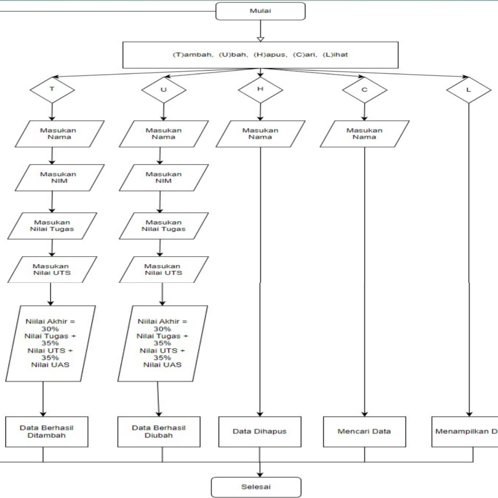

# Pertemuan 10 (Praktikum 5)
### Daftar Nilai Mahasiswa Menggunakan **Dictionary**

#### Nama : Muhammad Ilham Sofyan Saifudin
#### Kelas: TI 22 A3
#### NIM  : 312210297

### Flowchart
- Pertama tama buatlah flowchart sebelum membuat programnya



- Lalu buatlah sebuah dictionary kosong yang nantinya akan diinputkan data ketika program dijalankan.
```
Data = {}
```

- Buat kondisi perulangan dan sebuah keterangan untuk pilihan menu yang akan menjalankan program.
```
while True:
    List = input("\n(T)ambah, (U)bah, (H)apus, (C)ari, (L)ihat, (K)eluar: ")
```
- Membuat syntax untuk menambahkan data.
- Disini ketika kita menginputkan 't' maka akan diminta untuk menginputkan beberapa data.
```
if List.lower() == 't':
        print("Tambah Data")
        nama = input("Nama           : ")
        nim = int(input("NIM            : "))
        tugas = int(input("Nilai Tugas    : "))
        uts = int(input("Nilai UTS      : "))
        uas = int(input("Nilai UAS      : "))
        akhir = tugas*30/100 + uts*35/100 + uas*35/100
        Data[nama] = nim, tugas, uts, uas, akhir
```

- Membuat syntax untuk mengubah data.
- Ketika kita menginput 'u' maka akan muncul keterangan untuk mengubah data dan akan diminta untuk menginputkan nama yang mau diubah datanya, apabila nama tidak tersedia maka muncul output "Nama {} tidak ditemukan".
```
elif List.lower() == 'u':
        print("Ubah Data")
        nama = input("Masukkan Nama  : ")
        if nama in Data.keys():
            nim = int(input("NIM            : "))
            tugas = int(input("Nilai Tugas    : "))
            uts = int(input("Nilai UTS      : "))
            uas = int(input("Nilai UAS      : "))
            akhir = tugas * 30 / 100 + uts * 35 / 100 + uas * 35 / 100
            Data[nama] = nim, tugas, uts, uas, akhir
        else:
            print("Nama {0} tidak ditemukan".format(nama))
```


- Membuat syntax untuk menghapus data.
- Saat kita menginput 'h' maka akan diminta menginput nama yang akan dihapus.Jika nama tersedia di dalam dictionary,maka system akan menghapus nama tersebut.
```
elif List.lower() == 'h':
        print("Hapus Data")
        nama = input("Masukkan Nama  : ")
        if nama in Data.keys():
            del Data[nama]
        else:
            print("Nama {0} Tidak Ditemukan".format(nama))
```

- Membuat syntax untuk mencari data
- Disaat menginputkan 'c' maka akan diminta untuk memasukkan nama yang akan dicari.Apabila nama yang dicari tersedia di dalam dictionary maka outputnya akan menampilkan berupa data dari nama tersebut.
```
elif List.lower() == 'c':
        print("Cari Data")
        nama = input("Masukkan Nama : ")
        if nama in Data.keys():
            print("="*73)
            print("|                             Daftar Mahasiswa                          |")
            print("="*73)
            print("| Nama            |       NIM       |  UTS  |  UAS  |  Tugas  |  Akhir  |")
            print("="*73)
            print("| {0:15s} | {1:15d} | {2:5d} | {3:5d} | {4:7d} | {5:7.2f} |"
                  .format(nama, nim, uts, uas, tugas, akhir))
            print("="*73)
        else:
            print("Nama {0} Tidak Ditemukan".format(nama))
```

- Membuat syntax untuk menampilkan data.
- Disaat menginput 'l' maka sistem akan menampilkan data yang sudah kita masukkan sebelumnya.Jika kita belum menginputkan data maka outputnya "TIDAK ADA DATA".
```
elif List.lower() == 'l':
        if Data.items():
            print("="*78)
            print("|                               Daftar Mahasiswa                             |")
            print("="*78)
            print("|No. | Nama            |       NIM       |  UTS  |  UAS  |  Tugas  |  Akhir  |")
            print("="*78)
            i = 0
            for j in Data.items():
                i += 1
                print("| {no:2d} | {0:15s} | {1:15d} | {2:5d} | {3:5d} | {4:7d} | {5:7.2f} |"
                      .format(j[0][:13], j[1][0], j[1][1], j[1][2], j[1][3], j[1][4], no=i))
            print("=" * 78)
        else:
            print("="*78)
            print("|                               Daftar Mahasiswa                             |")
            print("="*78)
            print("|No. | Nama            |       NIM       |  UTS  |  UAS  |  Tugas  |  Akhir  |")
            print("="*78)
            print("|                                TIDAK ADA DATA                              |")
            print("="*78)
```

- Membuat syntax untuk menghentikan perulangan.
- Disaat kita menginput 'k' maka program akan langsung terhenti.

```
 elif List.lower() == 'k':
            break
```


- Membuat syntax untuk memilih pilihan yang tidak ada di dalam menu.
- Jika kita menginput kata selain yang ada di dalam menu disamping(t, u, h, c, l, k) maka kita akan diminta oleh system untuk memilih menu yang tersedia.

```
 else:
        print("Pilih menu yang tersedia")


